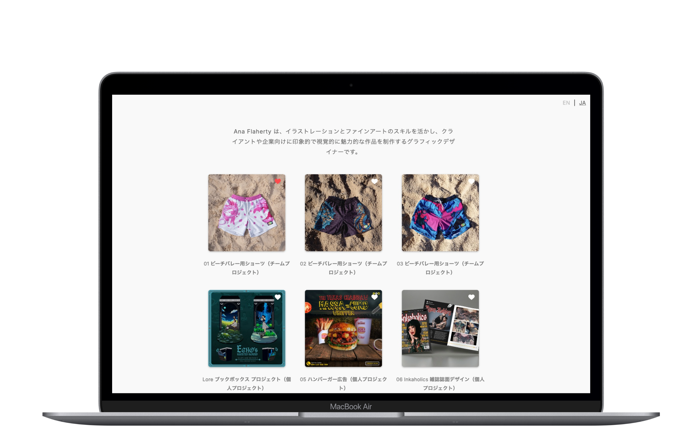
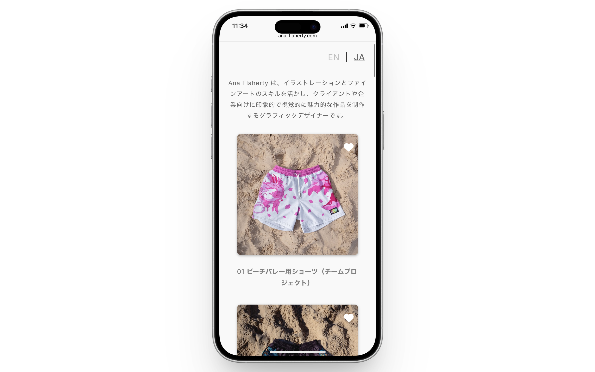

## 使用技術一覧

  <!-- バックエンド -->
  
  
  

  <!-- フロントエンド -->
  
  
  
  

  <!-- DB -->
  

  <!-- インフラ -->
  

## 本番環境URL

## 目次
1. [プロジェクトについて](#プロジェクトについて)
2. [スクリーンショット](#スクリーンショット)
3. [環境](#環境)
4. [工夫したポイント](#工夫したポイント)

## プロジェクト名
デザイナー用ポートフォリオWebアプリ

## プロジェクトについて
- デザイナーの作品を展示できるポートフォリオサイト
- 将来的な販売機能を見据えた構成
- PC・スマホ対応、ミニマルデザイン
- 英語・日本語の多言語対応

## スクリーンショット

  

  

## ショートデモ
[▶ デモをみる（約30秒）](https://ana-flaherty.com/media/portfolio-demo.v1.mp4)

## 環境
| 言語・フレームワーク  | バージョン |
| ---------------------- | ---------- |
| Python                 | 3.10.9     |
| Django                 | 5.0.14     |
| Django REST Framework  | 3.16.0     |
| JavaScript (Vanilla)   | ES6+       |
| TypeScript             | 5.3.3      |
| HTML                   | 5          |
| CSS                    | 3          |
| PostgreSQL             | 14.18      |
| AWS                    | Elastic Beanstalk RDS (PostgreSQL) S3 CloudFront Route 53 ACM |

## 工夫したポイント
- Django REST FrameworkでAPIを構築し、Vanilla JSから非同期通信で操作
- AWS（Elastic Beanstalk, RDS, S3, CloudFront, Route 53, ACM）で**運用の容易さと安定性を重視**した構成で、将来的な拡張にも対応可能
- URLパス・HTTPヘッダ両対応の多言語切替機能
